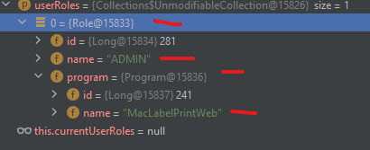
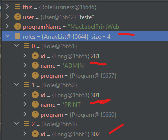

# Tasks - Terça (03.11.2022)

|  |  | [Bruno Valentim](mailto:Bruno.Valentim@inex.com.br) |
| :----------------------------------------------------------------------- | :------------------------------------------------------------------------------------: | --------------------------------------------------: |

## **`Menu`**  
- [Tasks - Terça (03.11.2022)](#tasks---terça-03112022)
  - [**`Menu`**](#menu)
  - [- 1.2 Resultado](#--12-resultado)
  - [1 **`Controle de Acesso`**](#1-controle-de-acesso)
---

## 1 **`Controle de Acesso`**  
  
- >### 1.1 **`Funcionalidades Impactadas`**  
  >```
  > IMPRESSÃO
  > DOUBLE CHECK
  > CONFIGURAÇÃO
  >```

- ### 1.2 **`Rules`**
  > - #### 1.2.1 **`Rules`** na Base de Dados para **`MacLabelPrintWeb`**  
    >>```SQL
    >>SELECT DISTINCT RP.NAME AS PROGRAM_NAME,R.NAME AS PROGRAM_RULE
    >>FROM FOCUS.R_ROLE_T R ,FOCUS.R_PROGRAM_T RP 
    >>WHERE RP.NAME = 'MacLabelPrintWeb';
    >>```
  > - #### 1.2.2 **`Saída:`**  
    >>```
    >>ADMIN
    >>AGUARDANDO_SN  
    >>AOI 1 DEBUG  
    >>AOI 2 DEBUG  
    >>APROVAR_WO  
    >>CAB_SETUP  
    >>CANCELAR_WO  
    >>CHANGE_PASSWORD  
    >>CHANGE_PREFERENCES  
    >>CLOSE_ECR  
    >>CONFIG_GROUP  
    >>```  
    
- ### 1.3 **`Novas Rules`**
  > - #### 1.3.1 `Rules` **adicionadas** na Base de Dados para **`MacLabelPrintWeb`**   
  >>```SQL
  >>INSERT INTO FOCUS.R_ROLE_T R (R.NAME,R."ProgramID") 
  >>VALUES ('PRINT',(SELECT DISTINCT RP.ID FROM FOCUS.R_PROGRAM_T RP WHERE RP.NAME = 'MacLabelPrintWeb'));
  >>INSERT INTO FOCUS.R_ROLE_T R (R.NAME,R."ProgramID") 
  >>VALUES ('DOUBLE_CHECK',(SELECT DISTINCT RP.ID FROM FOCUS.R_PROGRAM_T RP WHERE RP.NAME = 'MacLabelPrintWeb'));
  >>INSERT INTO FOCUS.R_ROLE_T R (R.NAME,R."ProgramID") 
  >>VALUES ('CONFIGURATION',(SELECT DISTINCT RP.ID FROM FOCUS.R_PROGRAM_T RP WHERE RP.NAME =  'MacLabelPrintWeb'));
  >>COMMIT;
  >>```
  > - #### 1.3.2 **`Saída:`**  
  >>```
  >> - PRINT
  >> - DOUBLE_CHECK
  >> - CONFIGURATION
  >>```

- ### 1.4 **`Novas Rules`**
  > - #### 1.4.1 Adicionado **`Profiles`** com as novas Rules  
  >>```SQL
  >>--- PRINT
  >>INSERT INTO FOCUS.R_PROFILE_ROLE_T PR (PR.PROFILE_ID,PR.ROLE_ID) 
  >>VALUES ((SELECT 
  >>DISTINCT D.PROFILE_ID 
  >>FROM 
  >>FOCUS.R_ROLE_T A,
  >>FOCUS.R_PROGRAM_T B,
  >>FOCUS.R_PROFILE_T C,
  >>FOCUS.R_USER_PROFILE_T D,
  >>FOCUS.R_AUTHENTICATION_T U,
  >>FOCUS.R_PROFILE_ROLE_T e
  >>WHERE
  >>A."ProgramID" = B.id
  >>AND B.ID = C."ProgramID" 
  >>AND C.ID = D.PROFILE_ID 
  >>AND U."Name"  = 'teste' 
  >>AND E.PROFILE_ID = C.ID
  >>AND E.ROLE_ID = A.ID
  >>AND B.NAME = 'MacLabelPrintWeb'),(SELECT R.ID  FROM FOCUS.R_ROLE_T R WHERE R.NAME = 'PRINT'));
  >>--- DOUBLE_CHECK
  >>INSERT INTO FOCUS.R_PROFILE_ROLE_T PR (PR.PROFILE_ID,PR.ROLE_ID) 
  >>VALUES ((SELECT 
  >>DISTINCT D.PROFILE_ID 
  >>FROM 
  >>FOCUS.R_ROLE_T A,
  >>FOCUS.R_PROGRAM_T B,
  >>FOCUS.R_PROFILE_T C,
  >>FOCUS.R_USER_PROFILE_T D,
  >>FOCUS.R_AUTHENTICATION_T U,
  >>FOCUS.R_PROFILE_ROLE_T e
  >>WHERE
  >>A."ProgramID" = B.id
  >>AND B.ID = C."ProgramID" 
  >>AND C.ID = D.PROFILE_ID 
  >>AND U."Name"  = 'teste' 
  >>AND E.PROFILE_ID = C.ID
  >>AND E.ROLE_ID = A.ID
  >>AND B.NAME = 'MacLabelPrintWeb'),(SELECT R.ID  FROM FOCUS.R_ROLE_T R WHERE R.NAME = 'DOUBLE_CHECK'));
  >>--- CONFIGURATION
  >>INSERT INTO FOCUS.R_PROFILE_ROLE_T PR (PR.PROFILE_ID,PR.ROLE_ID) 
  >>VALUES ((SELECT 
  >>DISTINCT D.PROFILE_ID 
  >>FROM 
  >>FOCUS.R_ROLE_T A,
  >>FOCUS.R_PROGRAM_T B,
  >>FOCUS.R_PROFILE_T C,
  >>FOCUS.R_USER_PROFILE_T D,
  >>FOCUS.R_AUTHENTICATION_T U,
  >>FOCUS.R_PROFILE_ROLE_T e
  >>WHERE
  >>A."ProgramID" = B.id
  >>AND B.ID = C."ProgramID" 
  >>AND C.ID = D.PROFILE_ID 
  >>AND U."Name"  = 'teste' 
  >>AND E.PROFILE_ID = C.ID
  >>AND E.ROLE_ID = A.ID
  >>'CONFIGURATION'));
  >>COMMIT;
  >>```  

  - ### 1.5 **`Resultado`**
  > - #### 1.5.1 **Antes**
  >>
  >>
  >>  - #### 1.2.3 **Agora**
  >>
  >>