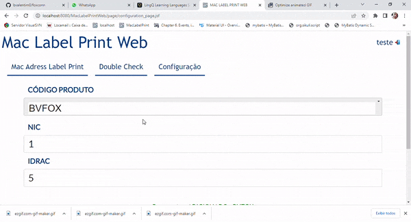

# Tasks - Sexta (04.11.2022)

|  |  | [Bruno Valentim](mailto:Bruno.Valentim@inex.com.br) |
| :----------------------------------------------------------------------- | :------------------------------------------------------------------------------------: | :-------------------------------------------------- |

## **`Menu`**  
> - [1 **`(MacLabelPrintWeb) Testes e Ajutes Finos`**](#1-Testes-e-Ajutes-Finos)  
>   - [1.1 **`Funcionalidades Impactadas`**](#12-Funcionalidades-Impactadas)  
>   - [1.2 **`LOGIN`**](#12-LOGIN)  
>     - [1.2.1 Testes **`LOGIN`**](#121-Testes-LOGIN) 
>     - [1.2.2 **`Saída`**](#122-Saída)  
>   - [1.3 **`PERMISSÕES`**](#13-PERMISSÕES)  
>     - [1.3.1 Testes **`PERMISSÕES`**](#131-Testes-PERMISSÕES) 
>     - [1.3.2 **`Saída`**](#132-Saída)  
>   - [1.4 **`IMPRESSÃO`**](#14-IMPRESSÃO)  
>     - [1.4.1 Testes **`IMPRESSÃO`**](#141-Teste-IMPRESSÃO) 
>   - [1.5 **`DOUBLE CHECK`**](#15-DOUBLE-CHECK)  
>     - [1.5.1 Testes **`DOUBLE CHECK`**](#151-Testes-DOUBLE-CHECK) 
>   - [1.6 **`CONFIGURAÇÃO`**](#16-CONFIGURAÇÃO)  
>     - [1.6.1 Selecionar **`CONFIGURAÇÃO`**](#161-Selecionar-CONFIGURAÇÃO) 
>     - [1.6.2 Criar **`CONFIGURAÇÃO`**](#162-Criar-CONFIGURAÇÃO) 
>     - [1.6.3 Alterar **`CONFIGURAÇÃO`**](#163-Alterar-CONFIGURAÇÃO) 
>     - [1.6.4 Remover **`CONFIGURAÇÃO`**](#164-Remover-CONFIGURAÇÃO) 
    
- ## 1 **`Testes e Ajutes Finos`**  
  - ### 1.1 **`Funcionalidades Impactadas`**  
    - > LOGIN
    - > PERMISSÕES
    - > IMPRESSÃO
    - > DOUBLE CHECK
    - > CONFIGURAÇÃO
  - ### 1.2 **`LOGIN`**
    > - #### 1.2.1 Testes **`LOGIN`**  
      >>Login `Inválido`
      >>
    > - #### 1.2.2 **`Saída:`**  
      >>Login `OK`
      >>
  - ### 1.3 **`PERMISSÕES`**
    > - #### 1.3.1 Testes **`PERMISSÕES`**  
      >>
      >>
    > - #### 1.3.2 **`Saída:`**  
      >>
  - ### 1.4 **`IMPRESSÃO`**
    > - #### 1.4.1 Testes **`IMPRESSÃO`**  
      >>
  - ### 1.5 **`DOUBLE CHECK`**
    > - #### 1.5.1 Testes **`DOUBLE CHECK`**  
      >>  
  - ### 1.6 **`CONFIGURAÇÃO`**
    > - #### 1.6.1 Selecionar **`CONFIGURAÇÃO`**  
      >>  
    > - #### 1.6.2 Criar **`CONFIGURAÇÃO`**  
      >>  
    > - #### 1.6.3 Alterar **`CONFIGURAÇÃO`**  
      >>  
    > - #### 1.6.4 Remover **`CONFIGURAÇÃO`**  
      >>  
