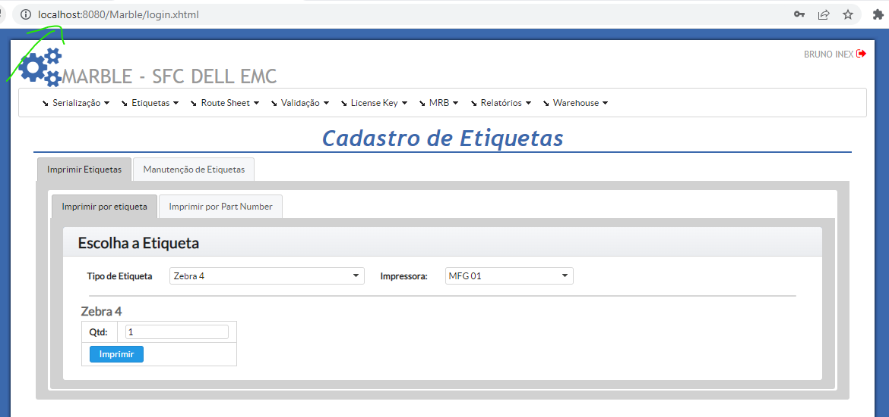
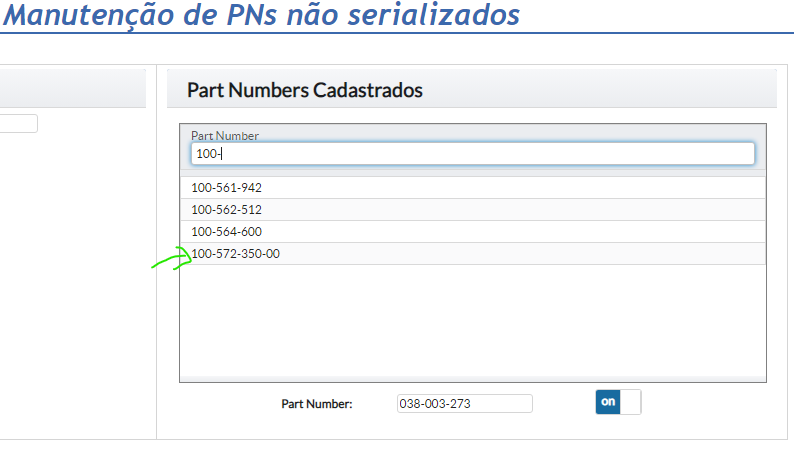
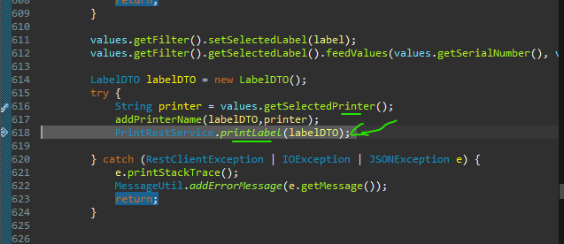

# Tasks - Quinta (10.11.2022)

|  |  | [Bruno Valentim](mailto:Bruno.Valentim@inex.com.br) |
| :----------------------------------------------------------------------- | :------------------------------------------------------------------------------------: | :-------------------------------------------------- |

## **`Menu`**  
> - [1 **`(EMC Marble) Setup Projeto`**](#1-(EMC-Marble)-Configuração)  
>   - [1.2 **`Setup Projeto`**](#12-Setup-Projeto)  
>     - [1.2.1 **`Subir Projeto Máquina - OK`**](#121-Subir-Projeto-Máquina)  
> - [2 **`(EMC Marble) Chamados`**](#2-(EMC-Marble)-Chamados)  
>   - [2.1 **`Por Data (Antigo para Novo) - Atuando`**](#21-Por-Data-(Antigo-para-Novo)) 

- _**[Break-Down EMC Marble](https://docs.google.com/spreadsheets/d/1HDS4bGO800q9nOA5XpNQDZUMK1PuaALCNTX9RzDUV3k/edit?usp=sharing)**_      
- ## 1 **`(EMC Marble) Setup Projeto`**  
  - ### 1.2 **`Setup Projeto`**
    > - #### 1.2.1 OK  
      >>
- ## 2 **`(EMC Marble) Chamados`**
  - ### 2.1 **`Por Data (Antigo para Novo)`**
    - > 22/12/2021  
      > - >Utilização das impressoras da MFG
      > - >Ajustado:
    - > 12/01/2022  
      > - >Sistema de recebimento sobrescreve um SN já criado.	Analisar qual deve ser o comportamento correto: impedir de receber? Subir a sequencia ate encontrar um serial que não existe?  
      > - >Depende de esclarecimento
    - > 13/01/2022  
      > - >Em PNs cadastrados, **não** tinha o **PN 100-572-350-00(ISL ACC)**	
      > - >Part Number encontrado: Obs: Procurar **sem* o '(ISL ACC)' ou ajustar o cadastro.
    - > 24/01/2022  
      > - >Etiqueta que está funcionado na impressão por modelo, **não** funciona o imprimir por **PN**
      > - >Adicionado  código para impressão:
      > - >Tela:
    - > 02/02/2022  
      > - >Função reimprimir etiqueta com SN	
      > - >Função de validar a etiqueta antes de continuar a impressão(para impressão de varias etiquetas)	
      > - >Ao mudar a função no add parametro, o mesmo não reflete na impresão de etiqueta	
    - > 07/03/2022  
      > - >Teste impressão Etiquetas nas impressoaras da MFG	
    - > ?  
      > - >Foi questionado a possibilidade de ter uma trava(Analisar se é possivel, porém temos que avaliar se não vai afetar outros processos)	