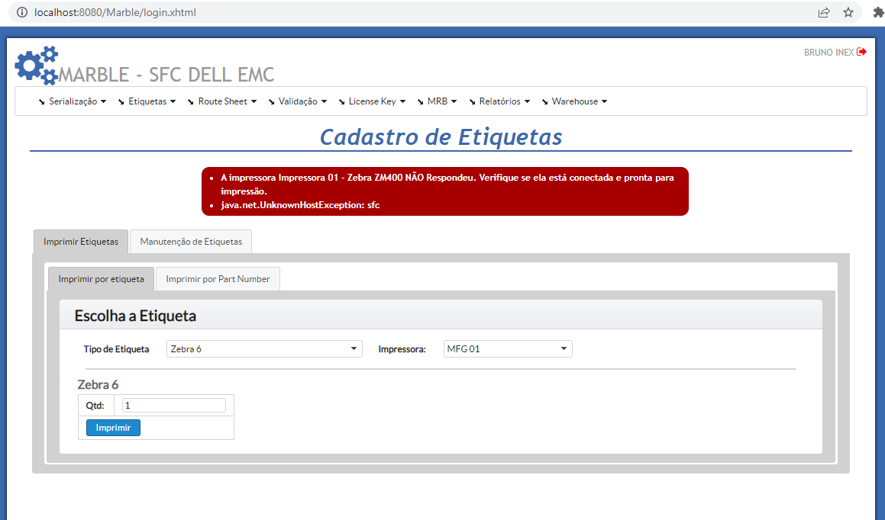

# Tasks - Segunda (25.11.2022)

|  |  | [Bruno Valentim](mailto:Bruno.Valentim@inex.com.br) |
| :----------------------------------------------------------------------- | :------------------------------------------------------------------------------------: | :-------------------------------------------------- |

## **`Menu`**  
> - [1 **`(EMC Marble) Black Label Print - Chamados Produção - Reportados em 23/11`**](#1-(EMC-Marble)-Black-Label-Print-Chamados_Produção-Reportados-em-23/11)  
>   - [1.1 **`Teste impressão Etiquetas nas impressoaras da MFG(TI) - [OK]`**](#1.1-Teste-impressão-Etiquetas-nas-impressoaras-da-MFG(TI)-[OK]) 
>   - [1.2 **`Etiqueta que está funcionado na impressão por modelo, não funciona o imprimir por PN - [OK]`**](#1.2-Etiqueta-que-está-funcionado-na-impressão-por-modelo,-não-funciona-o-imprimir-por-PN-[OK]) 

[_**Break Down: (EMC Marble) Black Label Print - Chamados Produção - Reportados em 23/11**_](https://docs.google.com/spreadsheets/d/1DS3-2gIzGAqaz1-2YM7QAHjTHt7WjgWQFiTyYxINpNk/edit#gid=0)  
- ## 1 **`(EMC Marble) Black Label Print - Chamados Produção - Reportados em 23/11`**
  - ### 1.1 **`Teste impressão Etiquetas nas impressoaras da MFG(TI) - [OK]`**
      - > Teste impressão Etiquetas nas impressoaras da MFG(TI).
      - > **`Criado tratamento para quando Impressora não responde:`**
  - ### 1.2 **`Etiqueta que está funcionado na impressão por modelo, não funciona o imprimir por PN - [OK]`**
      - > Etiqueta que está funcionado na impressão por modelo, não funciona o imprimir por PN).
      - > **`Ajustado`**
