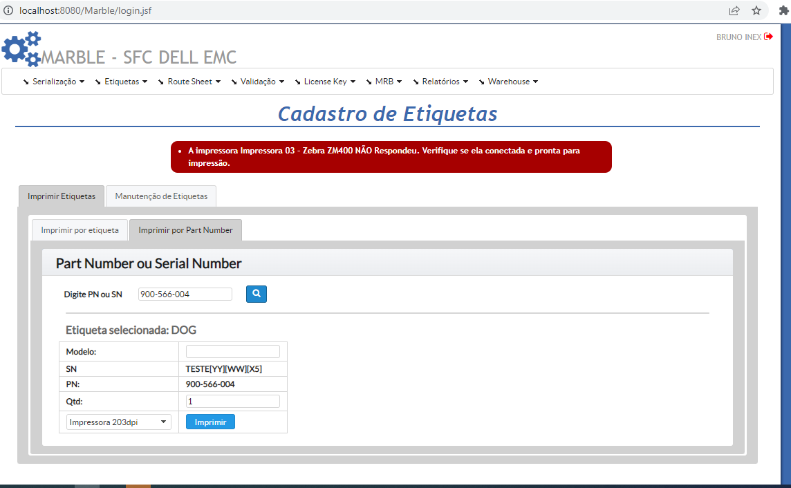

# Tasks - Terça (28.11.2022)

|  |  | [Bruno Valentim](mailto:Bruno.Valentim@inex.com.br) |
| :----------------------------------------------------------------------- | :------------------------------------------------------------------------------------: | :-------------------------------------------------- |

## **`Menu`**  
> - [1 **`(EMC Marble) Black Label Print - Chamados Produção - Reportados em 23/11`**](#1-(EMC-Marble)-Black-Label-Print-Chamados_Produção-Reportados-em-23/11)  
>   - [1.1 **`Ao mudar a função no add parametro, o mesmo não reflete na impresão de etiqueta - [OK]`**](#1.1) 
>   - [1.2 **`Teste impressão Etiquetas nas impressoaras da MFG - [OK]`**](#1.2) 
[OK]) 

[_**Break Down: (EMC Marble) Black Label Print - Chamados Produção - Reportados em 23/11**_](https://docs.google.com/spreadsheets/d/1DS3-2gIzGAqaz1-2YM7QAHjTHt7WjgWQFiTyYxINpNk/edit#gid=0)  
- ## 1 **`(EMC Marble) Black Label Print - Chamados Produção - Reportados em 23/11`**
  - ### 1.1 **`Ao mudar a função no add parametro, o mesmo não reflete na impresão de etiqueta - [OK]`**
      - > Ao selcionar etiquetas por PN, aparece essa msg de erro:
      - > **`Criado tratamento para quando Impressora não responde:`**
  - ### 1.2 **`Teste impressão Etiquetas nas impressoaras da MFG - [OK]`**
      - > **`Criado tratamento para quando Impressora não responde:`**
  