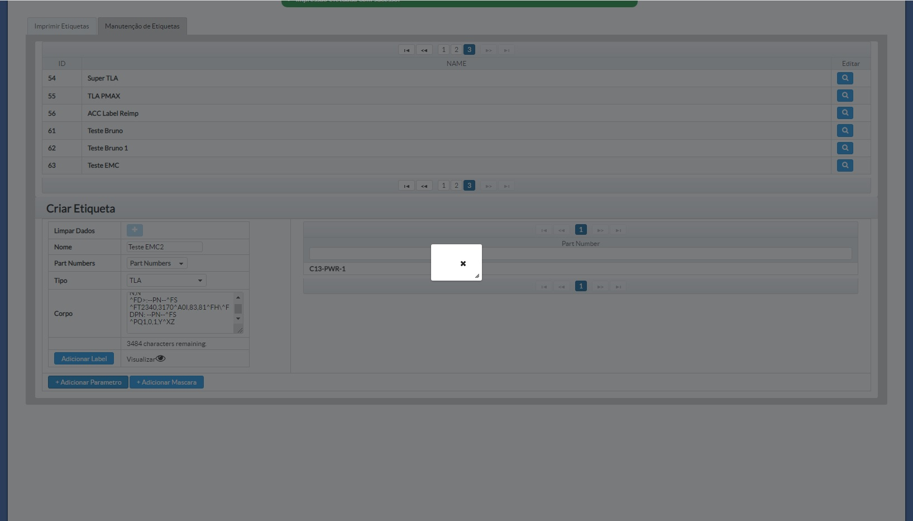
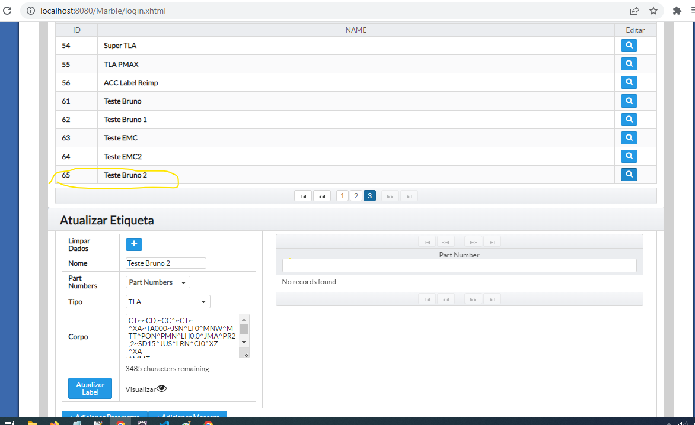

# Tasks - Quarta (30.11.2022)

|  |  | [Bruno Valentim](mailto:Bruno.Valentim@inex.com.br) |
| :----------------------------------------------------------------------- | :------------------------------------------------------------------------------------: | :-------------------------------------------------- |

## **`Menu`**  
> - [1 **`(EMC Marble) Black Label Print - Grupo WhatsApp`**](#1-(EMC-Marble)-Black-Label-Print-Chamados_Produção-Reportados-em-23/11)  
>   - [1.1 **`Ao inserir as informações de uma etiqueta nova, eu preciso clicar em add label para poder adicionar algum parâmetro/mascara....se não fizer isso aparece esse erro da img.  - [OK]`**](#1.1) 
>   - [1.2 **`Se eu clicar em atualizar label, ele permite que eu adicione os parâmetros/máscaras porém não salva nenhuma alteração. E da msg de erro ao clicar em atualizar label. - [OK]`**](#1.2) 

[_**Break Down: (EMC Marble) Black Label Print - Grupo WhatsApp**_](https://docs.google.com/spreadsheets/d/1DS3-2gIzGAqaz1-2YM7QAHjTHt7WjgWQFiTyYxINpNk/edit#gid=0)  
- ## 1 **`(EMC Marble) Black Label Print - Grupo WhatsApp`**
  - ### 1.1 **`Ao inserir as informações de uma etiqueta nova, eu preciso clicar em add label para poder adicionar algum parâmetro/mascara....se não fizer isso aparece esse erro da img. - [OK]`**
      - > Evidência: 
      - > `[OK]` 
  - ### 1.2 **`Se eu clicar em atualizar label, ele permite que eu adicione os parâmetros/máscaras porém não salva nenhuma alteração. E da msg de erro ao clicar em atualizar label. - [OK]`**
      - > Se eu clicar em atualizar label, ele permite que eu adicione os parâmetros/máscaras porém não salva nenhuma alteração.
